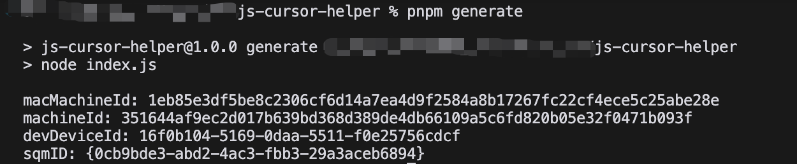

# 🚀 Cursor Free Trial Reset Tool

<div align="center">

[🌟 English](#english) | [🌏 中文](#chinese)


</div>

---

## 🌟 English

This project was inspired by [yuaotian/go-cursor-help](https://github.com/yuaotian/go-cursor-help/), and I would like to thank [yuaotian](https://github.com/yuaotian) for his contribution. This project is mainly focused on solving the problem of cursor-storage.json file location stored in the user's device, if you want to fool reset the Cursor trial, please use [yuaotian/go-cursor-help](https://github.com/yuaotian/go-cursor-help/), Use this project if you want to manually change the unique identifier in the Cursor-storage.json file.

### 📝 Description

> Resets Cursor's free trial limitation when you see:

```text
Too many free trial accounts used on this machine.
Please upgrade to pro. We have this limit in place
to prevent abuse. Please let us know if you believe
this is a mistake.
```

### 📝 Usage

```bash
# install dependencies
pnpm install

# generate new unique identifier
pnpm generate
```



### 💻 System Support

<table>
<tr>
<td>

**Windows** ✅

- x64 (64-bit)
- x86 (32-bit)

</td>
<td>

**macOS** ✅

- Intel (x64)
- Apple Silicon (M1/M2)

</td>
<td>

**Linux** ✅

- x64 (64-bit)
- x86 (32-bit)
- ARM64

</td>
</tr>
</table>

### 🔧 Technical Details

<details>
<summary><b>Configuration Files</b></summary>

The program modifies Cursor's `storage.json` config file located at:

- Windows: `%APPDATA%\Cursor\User\globalStorage\storage.json`
- macOS: `~/Library/Application Support/Cursor/User/globalStorage/storage.json`
- Linux: `~/.config/Cursor/User/globalStorage/storage.json`
</details>

<details>
<summary><b>Modified Fields</b></summary>

The tool generates new unique identifiers for:

- `telemetry.machineId`
- `telemetry.macMachineId`
- `telemetry.devDeviceId`
- `telemetry.sqmId`
</details>

<details>
<summary><b>Safety Features</b></summary>

- ✅ use `uuid` to generate unique identifier
- ✅ use `crypto` to encrypt the unique identifier
</details>

---

## 🌏 Chinese

本项目受[yuaotian/go-cursor-help](https://github.com/yuaotian/go-cursor-help/)启发，在此感谢[yuaotian](https://github.com/yuaotian)的贡献。本项目主要致力于解决 Cursor-storage.json 文件位置在用户设备中存储位置的问题，如果你想要傻瓜式重置 Cursor 试用期，请使用[yuaotian/go-cursor-help](https://github.com/yuaotian/go-cursor-help/)，如果你想要手动更改 Cursor-storage.json 文件中的唯一标识符，请使用本项目。


### 📝 问题描述

> 当看到以下提示时重置 Cursor 试用期：

```text
Too many free trial accounts used on this machine.
Please upgrade to pro. We have this limit in place
to prevent abuse. Please let us know if you believe
this is a mistake.
```

### 📝 使用

```bash
# 安装依赖
pnpm install

# 生成新的唯一标识符
pnpm generate
```


### 💻 系统支持

<table>
<tr>
<td>

**Windows** ✅

- x64 & x86

</td>
<td>

**macOS** ✅

- Intel & M-series

</td>
<td>

**Linux** ✅

- x64 & ARM64

</td>
</tr>
</table>

### 🔧 技术细节

<details>
<summary><b>配置文件</b></summary>

程序修改 Cursor 的`storage.json`配置文件，位于：

- Windows: `%APPDATA%\Cursor\User\globalStorage\`
- macOS: `~/Library/Application Support/Cursor/User/globalStorage/`
- Linux: `~/.config/Cursor/User/globalStorage/`
</details>

<details>
<summary><b>修改字段</b></summary>

工具会生成新的唯一标识符：

- `telemetry.machineId`
- `telemetry.macMachineId`
- `telemetry.devDeviceId`
- `telemetry.sqmId`
</details>

<details>
<summary><b>安全特性</b></summary>

- ✅ 使用 `uuid` 生成唯一标识符
- ✅ 使用 `crypto` 加密唯一标识符
</details>

## 📄 License

<details>
<summary><b>MIT License</b></summary>

Copyright (c) 2025 Simon Johnson

Permission is hereby granted, free of charge, to any person obtaining a copy
of this software and associated documentation files (the "Software"), to deal
in the Software without restriction, including without limitation the rights
to use, copy, modify, merge, publish, distribute, sublicense, and/or sell
copies of the Software, and to permit persons to whom the Software is
furnished to do so, subject to the following conditions:

The above copyright notice and this permission notice shall be included in all
copies or substantial portions of the Software.

THE SOFTWARE IS PROVIDED "AS IS", WITHOUT WARRANTY OF ANY KIND, EXPRESS OR
IMPLIED, INCLUDING BUT NOT LIMITED TO THE WARRANTIES OF MERCHANTABILITY,
FITNESS FOR A PARTICULAR PURPOSE AND NONINFRINGEMENT. IN NO EVENT SHALL THE
AUTHORS OR COPYRIGHT HOLDERS BE LIABLE FOR ANY CLAIM, DAMAGES OR OTHER
LIABILITY, WHETHER IN AN ACTION OF CONTRACT, TORT OR OTHERWISE, ARISING FROM,
OUT OF OR IN CONNECTION WITH THE SOFTWARE OR THE USE OR OTHER DEALINGS IN THE
SOFTWARE.

</details>
